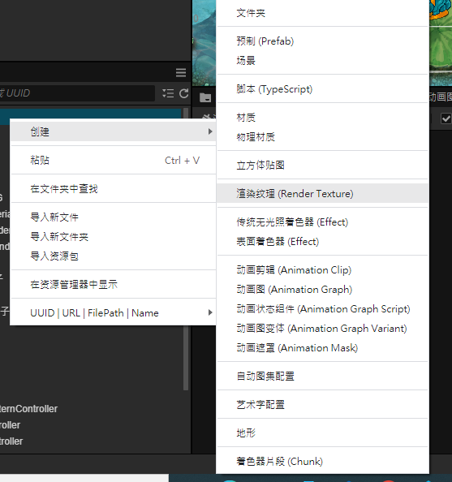
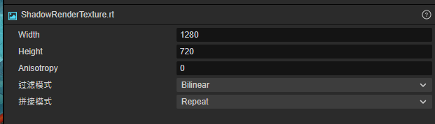
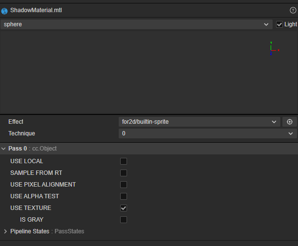
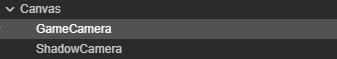
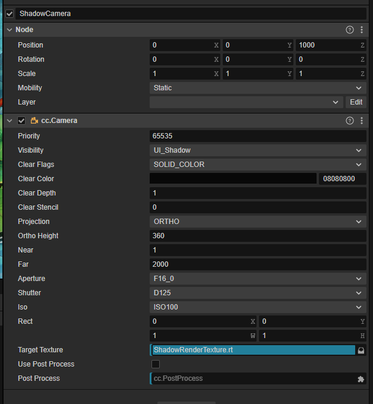
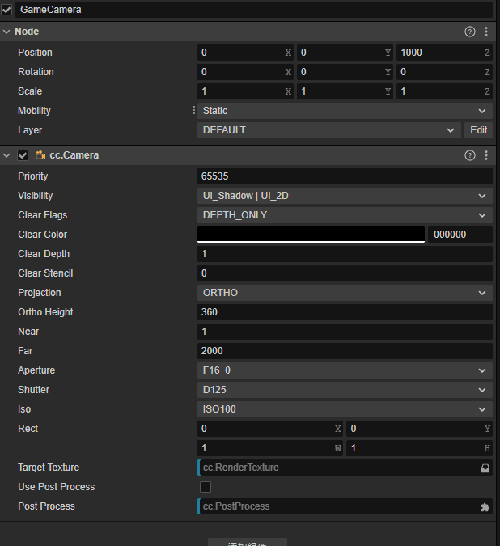
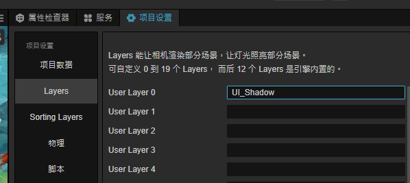
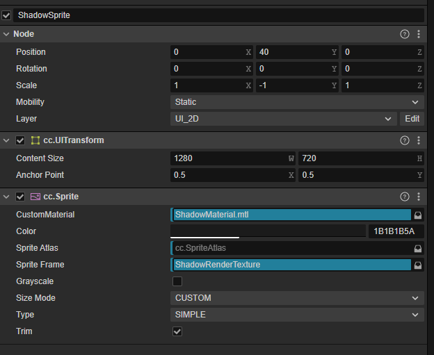
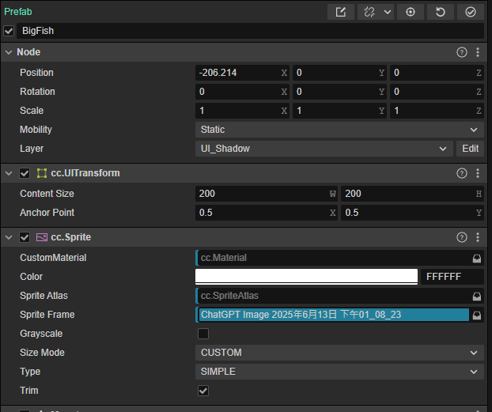

# 🌑 Cocos Creator 自製角色影子系統教學

本教學將帶你一步步使用 Cocos Creator 建立一套「動態影子系統」，讓角色能夠在地面投影，並且只有在角色與地面重疊時才會顯示影子效果。

---

## ✅ 教學步驟

### 1️⃣ 建立Render Texture + ShadowMaterial
- `ShadowRenderTexture`： 把相機(ShadowCamera)看到的畫面即時地渲染（畫）到一張貼圖上 。
-  `ShadowMaterial`： Effect 選builtin-sprite並勾選 USE TEXTURE。

---

### 2️⃣ 建立兩台 Camera

- `GameCamera`：主攝影機，用來渲染背景與角色。
- `ShadowCamera`：專門拍攝影子的攝影機。
  - `clearFlags` 設為 `COLOR`
  - `clearColor` 設為透明：`Color(0, 0, 0, 0)`
  - `targetTexture` 設為 `RenderTexture`，用來輸出影子畫面

---

### 3️⃣ 創建 Shadow Layer

到 `Project → Project Settings → Layers`，新增一個圖層名稱，例如：

---

### 4️⃣ 顯示影子：ShadowSprite + ShadowMaterial

- 新增一個 Sprite（例如叫做 ShadowSprite）
- 將其圖層設為 `UI_2D`
- 套用你自訂的 `ShadowMaterial` 材質（內部 shader 會判斷是否與 icon 圖交集）
- camera投影出來的畫面會呈現顛倒所以 scale y 要改為 -1。
- position Y 是跟原始圖片誤差位置。

---

### 5️⃣ 設定角色為 Shadow Layer

所有需要投影的角色都需要：

- 設定 `node.layer` 為 `UI_SHADOW`

就能有影子效果了

---